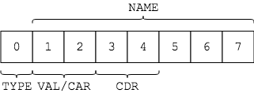

# 16-bit Lisp interpreter (work in progress)

Jake Herrmann  
CS 301 Fall 2018

TODO: toc

## Project goals

The **final goal** is a bootable, 16-bit Lisp interpreter for x86 real mode.

The **end of semester goal** is a partial implementation of the interpreter.
The partial interpreter should be able to:

- Construct the following Lisp objects: ints, symbols, pairs, and the empty
  list.
- Read an input expression and convert it into a Lisp object representing the
  expression's abstract syntax tree (AST).
- Print Lisp objects.

Evaluating expressions is not an explicit goal for the end of the semester, but
I may begin implementing expression evaluation if I have time.

## Background

Before starting this project I had not written an interpreter for any language.
I found it too difficult to tackle the problem in 16-bit assembly, so I decided
to write the [first version](https://notabug.org/jtherrmann/lisp-in-c) in C and
target 64-bit Linux. This was a good decision because it allowed me to focus on
writing an interpreter without the added challenge of doing so in 16-bit
assembly. After implementing a Lisp in C, I had a much better idea of how to do
the same in 16-bit NASM.

## Progress report

I have met my [goals](#project-goals) for the end of the semester and have
begun implementing [expression evaluation](#expressions).

TODO: documentation/presentation on how the goals have been met (e.g.
implementation details)

### Constructing objects

TODO:
- summary of Lisp object implementation
  - maybe (an) illustration(s)
  - C union equivalent / pseudocode (e.g. w/o types)
- free list implementation
  - initializing & using the free list
  - note that currently no GC, so eventually runs out of memory

For more details, see the comments under the "Lisp object" section near the top
of [lisp.asm](lisp/lisp.asm).

### Converting input to an AST

TODO

### Printing objects

TODO

## Getting started

Known to work on Debian GNU/Linux 9.5 (stretch).

1. Make sure `nasm` and `qemu` are installed.
2. Clone this repo, `cd` into `lisp/`, and run:

        nasm -f bin -o lisp.bin lisp.asm
        qemu-system-x86_64 lisp.bin

## Interpreter commands

The interpreter recognizes a handful of special commands:

- `:free` prints the current number of free Lisp objects.
- `:freelist` prints the current list of free Lisp objects, where each object
  is printed as its position in the list followed by its memory address.
- `:genv` prints the current global environment (a list of name-value pairs).
- `:help` prints the available interpreter commands.
- `:keymap` toggles between QWERTY and Dvorak.
- `:restart` reboots the computer.

## Expressions

Only a few kinds of expressions are currently supported:

- Ints, symbols, and the empty list
- The special form `quote`
- The special form `define`

Eventually, the interpreter will also support:

- The special form `cond`
- The special form `lambda`
- Function application

Ints and the empty list evaluate to themselves:

    > ()
    ()
    > 1
    1
    > 123
    123

The special form `quote` takes an argument and returns it without evaluating
it:

    > (quote 1)
    1
    > (quote foo)
    foo
    > (quote (1 2 3))
    (1 2 3)

The special form `define` binds a name to a value:

    > (define x 5)
    > x
    5
    > (define animals (quote (dog cat bird)))
    > animals
    (dog cat bird)

Attempting to evaluate either of the special forms `cond` or `lambda` results
in an invalid expression:

    > (lambda (x) x)
    Invalid expression:

      (lambda (x) x)

    Special form 'lambda' not yet implemented

Similarly, function applications are treated as invalid expressions:

    > (cons 1 2)
    Invalid expression:

      (cons 1 2)

    Function application not yet implemented

A function application is an attempt to evaluate any list other than the empty
list or one of the special forms.

## Error handling

The interpreter detects and handles various kinds of errors. For example, parse
errors:

    > (quote (1 2 3)
                    ^
    Parse error: incomplete list

And invalid expressions:

    > (define 1 2)
    Invalid expression:

      (define 1 2)

    1 is not a symbol
